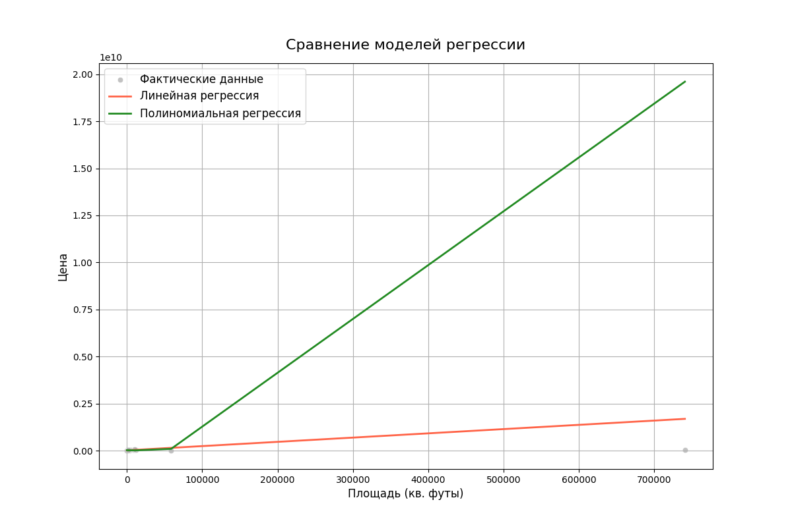
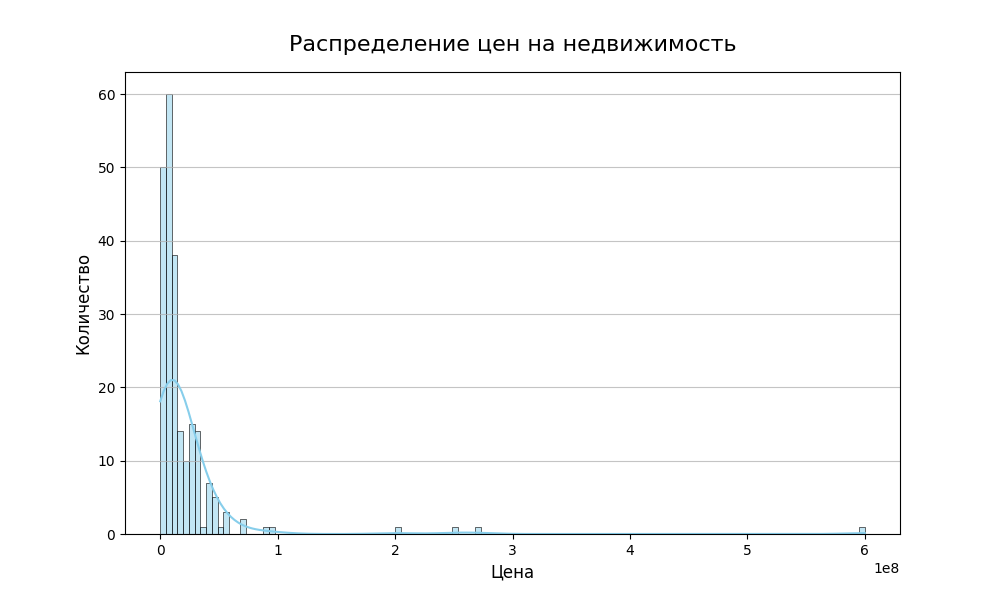
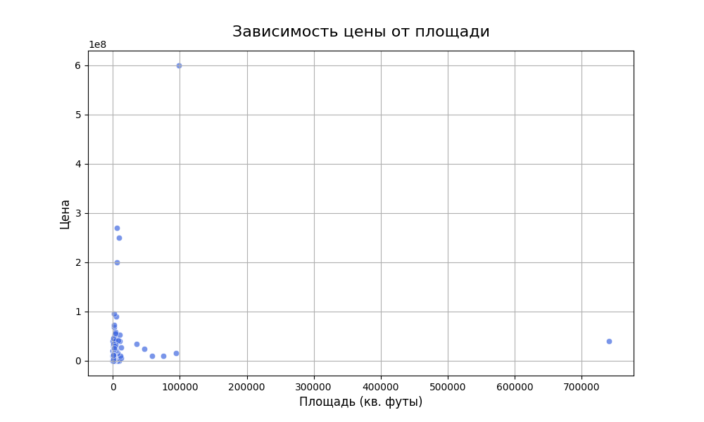

# Реализация линейной и полиноминальной регрессионных моделей 

## 1. Описание проекта
Данный проект был разработан в рамках дисциплины "МДК 13.01 Основы применения методов искусственного интеллекта в программировании".

**Практическое занятие №11**

**Тема:** реализация линейной регрессионной модели. Полиноминальная регрессия.

В этом проекте реализована линейная регрессионная модель для прогнозирования цен на недвижимость на основе различных факторов. Проект включает в себя визуализацию результатов. 
**Основная цель** - овладеть навыками разработки и применения линейной регрессионной модели с использованием полиномиальной регрессии.

## 2. Скриншоты
### 2.1. Скриншот выполненного задания
#### 2.1.1. Основной скрипт [main.py](src/main.py)

  

### 2.2. Конспект лекции

  
  

## 3. Графики и диаграммы
### 3.1. Сравнение моделей регрессии

  

### 3.2. Распределение цен на недвижимость

  

### 3.3. Зависимость цены от площади

  

## 4. Анализ результатов
Как видно из приведённых метрик, ни одна из моделей не показала удовлетворительных результатов. Значения коэффициента детерминации находятся значительно ниже нуля, что указывает на несоответствие модели данным. Это может быть связано с несколькими факторами:

1. **Низкое качество исходных данных:** Возможно, набор данных недостаточно информативен для построения точных моделей.
2. **Неправильный выбор зависимой переменной:** В данном случае преобразование столбца "size" в числовой формат могло привести к потере важной информации.
3. **Недостаток предобработки данных:** Например, отсутствие нормализации или стандартизации данных перед построением модели может негативно сказаться на результатах.

### 4.1. Результаты выполнения

#### 4.1.1. Линейная регрессия
- **MSE (среднеквадратичная ошибка):** $5.94 \times 10^{17}$
- **R² (коэффициент детерминации):** $-326.48$

#### 4.1.2. Полиномиальная регрессия (степень 2):
- **MSE (среднеквадратичная ошибка):** $8.32 \times 10^{18}$
- **R² (коэффициент детерминации):** $-45861.48$

## 5. Выводы
В проекте успешно реализованы и сравнены три различные модели классификации (SVM, логистическая регрессия и случайный лес) для прогнозирования выживаемости на Титанике. Все модели достигли разумной точности, при этом случайный лес немного превзошел другие после настройки гиперпараметров. Отчеты о классификации показывают хороший баланс между точностью и полнотой для всех моделей. Кривые обучения (которые следует включить в раздел "Графики и диаграммы") дадут представление о том, переобучаются ли модели или недообучаются, и улучшит ли производительность увеличение объема данных.

## 6. Обсуждение возможных улучшений
1. **Проверка качества данных:** Необходимо провести дополнительный анализ данных, выявить аномалии и устранить пропущенные значения.
2. **Выбор более подходящих признаков:** Рассмотреть возможность добавления дополнительных признаков или преобразования существующих.
3. **Оптимизация предобработки данных:** Включить нормализацию и стандартизацию данных перед моделированием.
4. **Настройка гиперпараметров моделей:** Исследовать влияние различных гиперпараметров на производительность моделей.
5. **Использование других алгоритмов:** Рассмотреть применение других методов регрессии, например, Ridge Regression или Lasso Regression.

## 7. Заключение
Работа позволила получить практические навыки создания и тренировки линейной и полиномиальной регрессионных моделей. Однако полученные результаты указывают на необходимость дополнительной работы над качеством данных и выбором подходящих методов моделирования.

## 8. Лицензия
Этот проект распространяется под лицензией MIT - смотрите файл [LICENSE](LICENSE) для деталей.

## 9. Автор
Бедин Владислав ([MindlessMuse666](https://github.com/MindlessMuse666))

* GitHub: [MindlessMuse666](https://github.com/MindlessMuse666 "Владислав: https://github.com/MindlessMuse666")
* Telegram: [@mindless_muse](t.me/mindless_muse)
* Gmail: [mindlessmuse.666@gmail.com](mindlessmuse.666@gmail.com)
